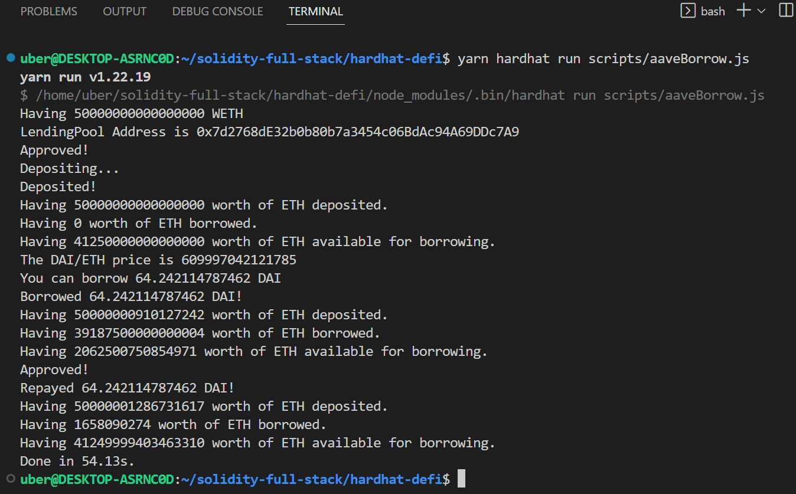

# Hardhat DeFi

Programmaticaly interacting with aave protocol

## Quickstart

```
git clone https://github.com/0xSanyam/hardhat-defi
cd hardhat-defi
yarn
```

## Usage

This repo requires a mainnet rpc provider, but don't worry! You won't need to spend any real money. We are going to do mainnet `forking`, and pretend as if we are interacting with mainnet contracts.

All you'll need, is to set a `MAINNET_RPC_URL` environment variable in a `.env` file that you create. You can get setup with one for free from [Alchemy](https://alchemy.com/)

Run:

```
yarn hardhat run scripts/aaveBorrow.js
```


